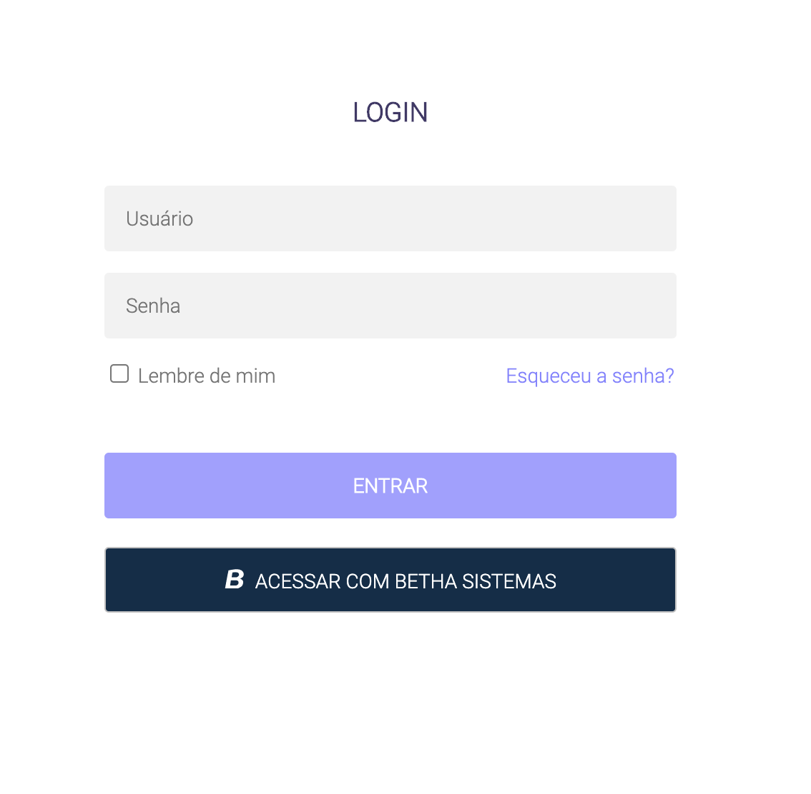

# autenticacao-spring-boot

Projeto para demonstrar a integração entre o fluxo de login da Plataforma Betha com uma aplicação rodando 
com Spring Boot. Embora esse exemplo tenha sido criado com Spring Boot, os códigos podem ser facilmente adaptados para 
outra tecnologia. 

# Autenticação
A camada de autenticação/autorização da Plataforma é disponibilizada sobre o protocolo OAuth 2. O OAuth 2 é um protocolo 
amplamente utilizado, principalmente por grandes players de plataforma, provendo acesso aos seus recursos de 
forma segura para aplicações de terceiros. 

Esse [artigo](https://www.digitalocean.com/community/tutorials/uma-introducao-ao-oauth-2-pt) pode ser útil para ajudar no entendimento

# Executando a aplicação

Para executar a aplicação, as seguintes ferramentas devem estar instaladas:

* Java 8 (ou superior)
* Maven 3.5.4 (ou superior)

No terminal, executar o comando:

```shell script
mvn spring-boot:run
```

Após, abrir o navegador em `http://localhost:8080`



Através do exemplo implementado é possível fazer login através da Plataforma Betha, e após o login realizado, o usuário 
é redirecionado para uma tela de detalhes do perfil.
